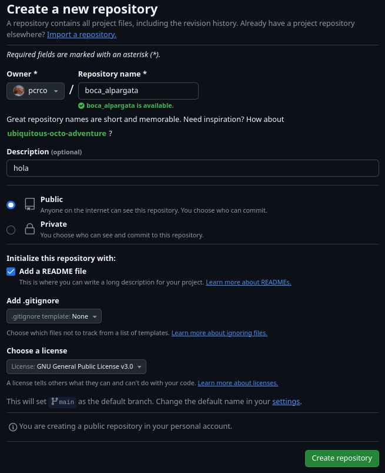
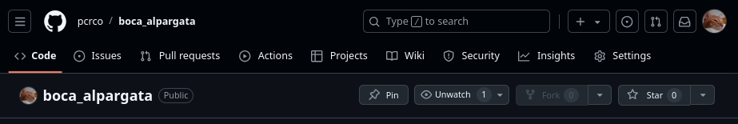
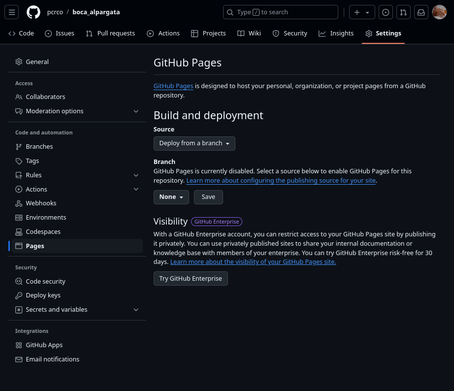
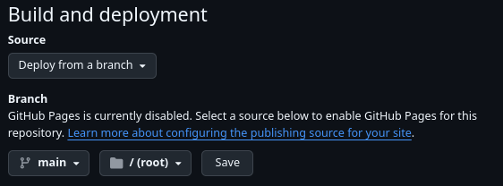
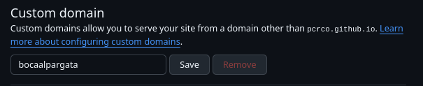
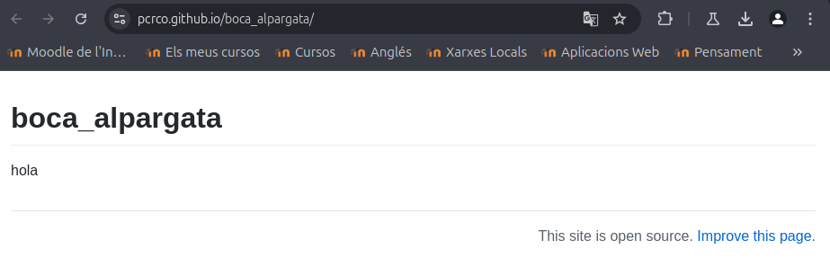

# Lista de hosts de páginas web gratuitos

| Proveedor      | Espacio de almacenamiento | Ancho de banda | Dominios y subdominios | Certificado SSL | Publicidad | Otras características |
|----------------|------------------------|----------------|-----------------------|----------------|------------|--------------------------------|
| [GitHub](https://github.com/) | 1 GB | 100GB al mes | Dominio y subdominio | No, pero soporta HTTPS | No incluye anuncios y puedes poner los tuyos. | Soporte para WordPress. |
| [Free Hosting](https://www.freehosting.com/) | 10 GB | Ilimitado | Dominios, no subdominios | Pagando | Puedes poner anuncios | Compatible con MySQL |
| [InfinityFree](https://www.infinityfree.com/) | 5 GB | Ilimitado | Dominios y subdominios | SSL gratis | No ponen publicidad | Compatible con MySQL |
| [Wix](https://es.wix.com/) | 500 MB | 500 MB | Subdominio y dominio | SSL gratis | No | No tiene soporte para WordPress |
| [Byet](https://byet.host/) | 1 GB | 50 GB | Dominio y subdominio | Solo premium | No | Compatible con MySQL |

No he podido documentar el uso de algunos hosts que he escogido, ya que en [Free Hosting](https://www.freehosting.com/) es obligatorio añadir una tarjeta de crédito a pesar de que se indica que el servicio es gratuito.

## GitHub

Si quieres crear y hostear tu página en GitHub, debes seguir estos pasos

1. Crear un repositorio

*Es recomendable hacerlo con esta configuración*

Ahora, para crear tu página web, elije donde la vas a hacer, ya que GitHub mostrará únicamente uno de estos archivos en tu página: `index.html`, `index.md` o `README.md`.

Vamos a poner como ejemplo que quieres mostrar lo que se ve en tu `README.md`:

2. Ve a la configuración de tu repositorio.

3. Busca `Pages` o `Páginas`en la barra lateral y selecciona estos parámetros. Luego, guarda los cambios.

4. Pon el dominio que quieres para tu página y dale a guardar.

5. Listo! Ya tienes tu página. En este caso, se está mostrando el único archivo que hay, el `README.md`.

https://pcrco.github.io/boca_alpargata/ 