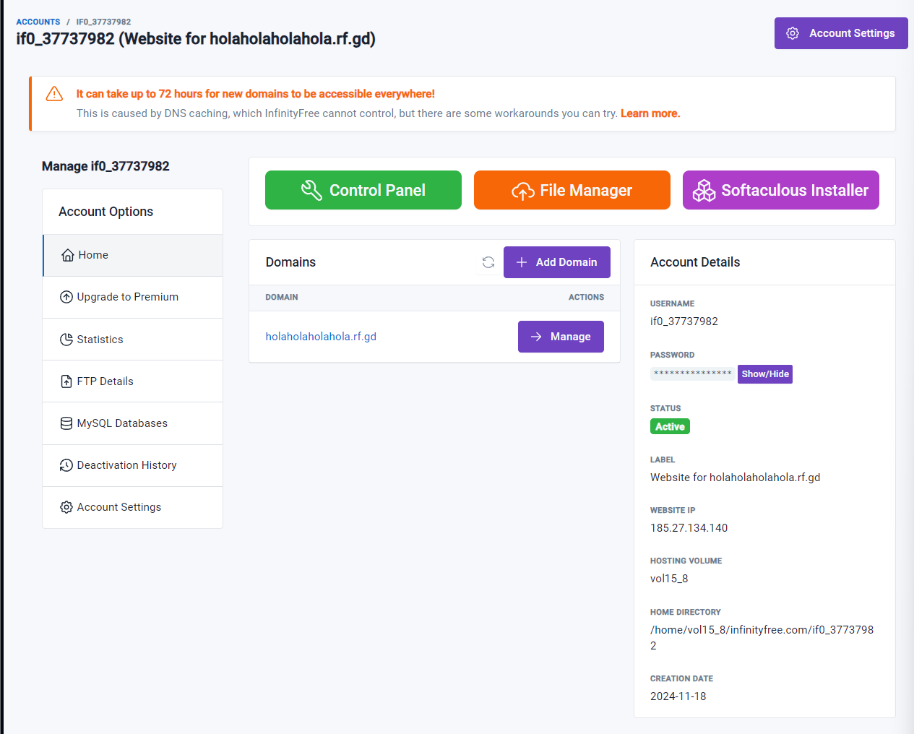
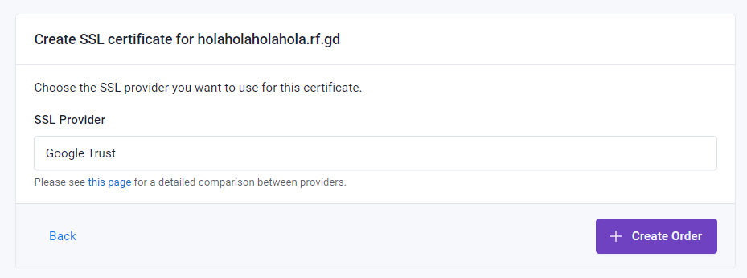
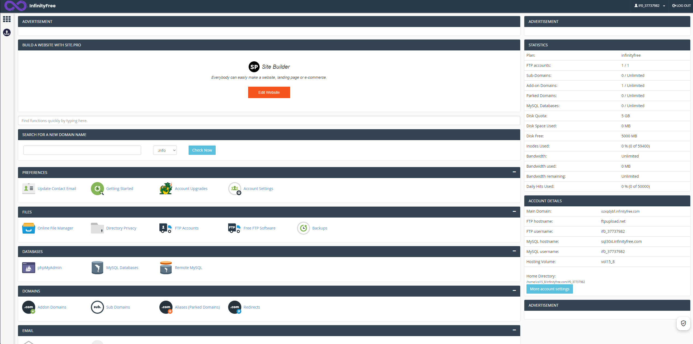
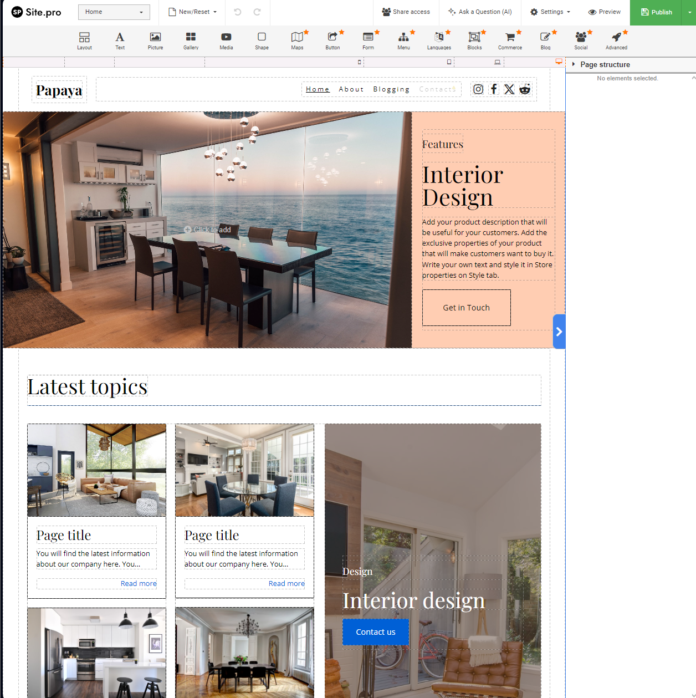
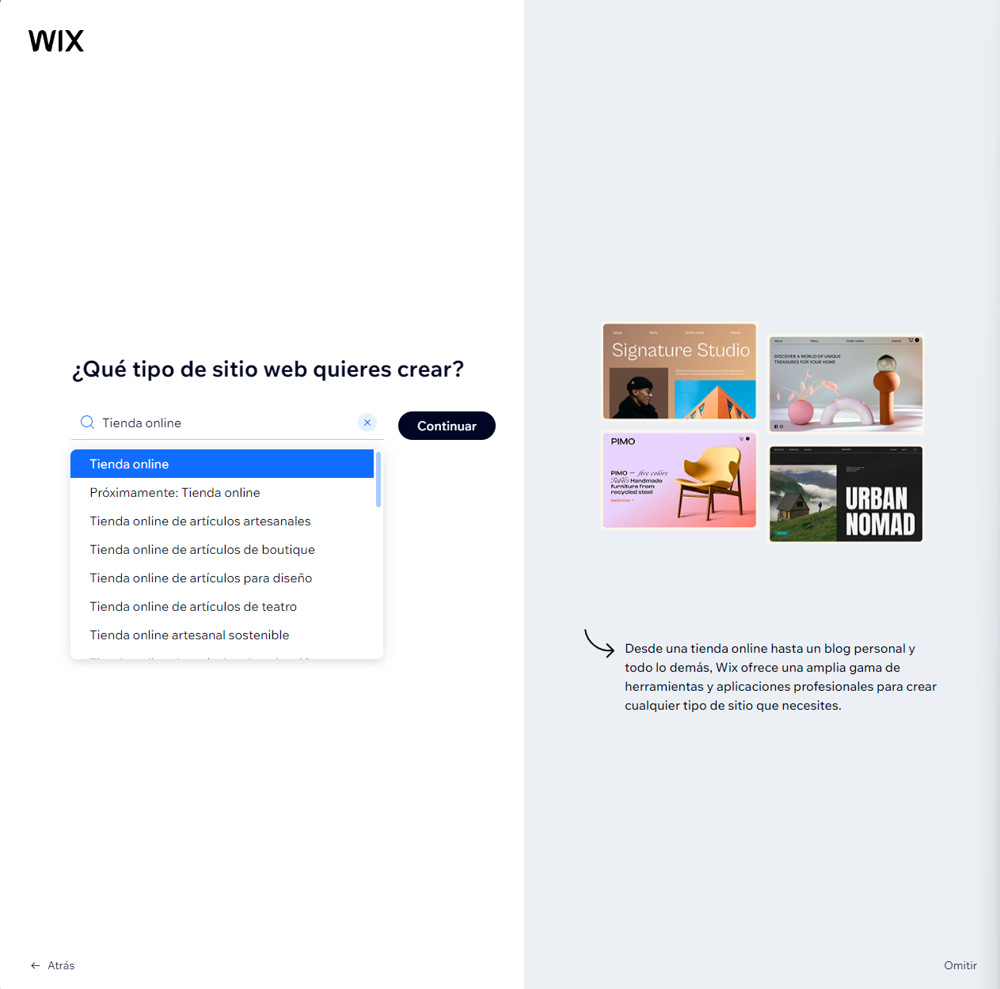
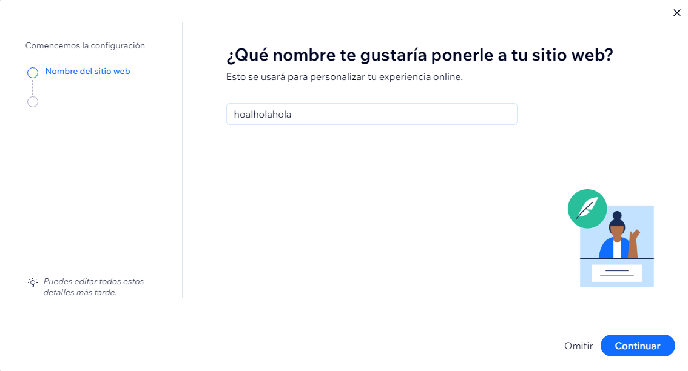
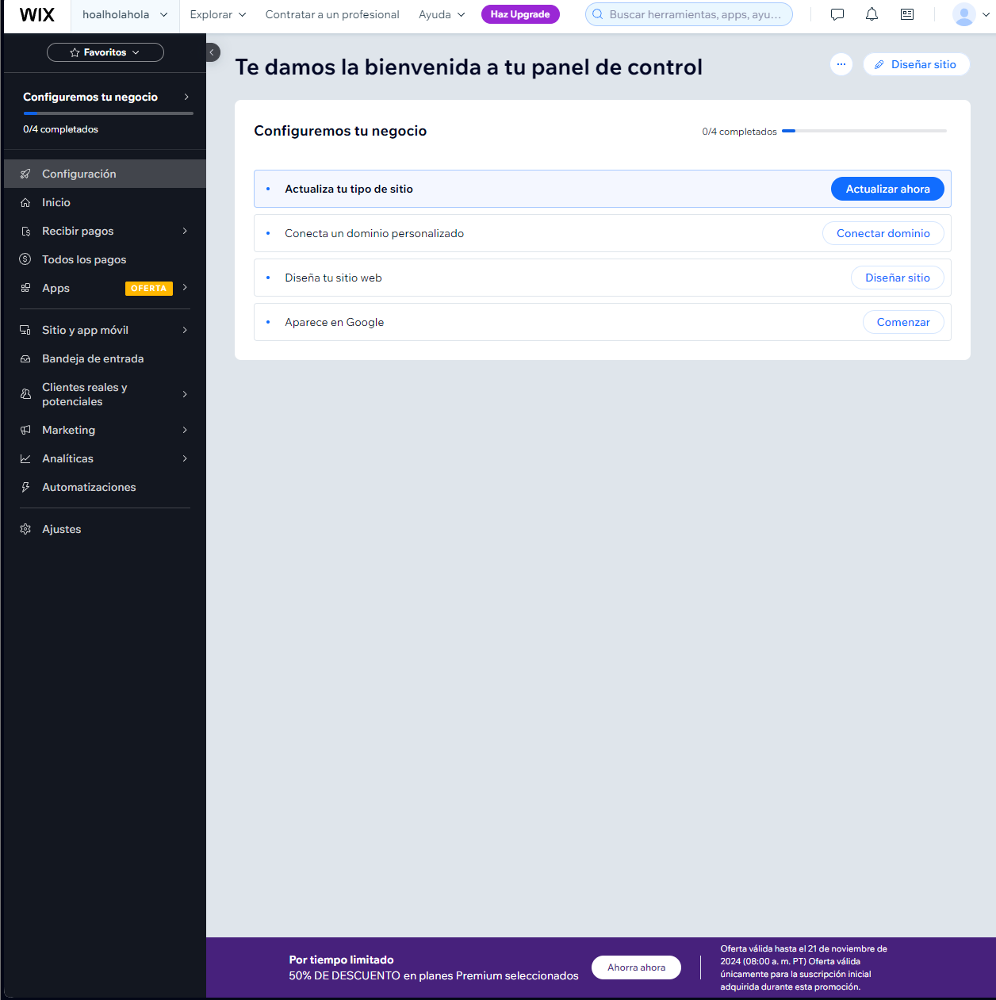
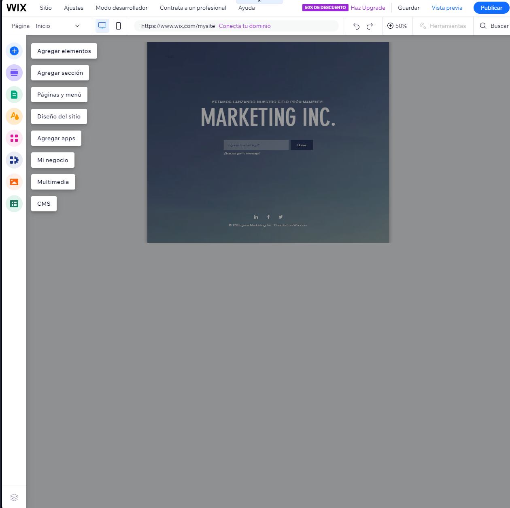
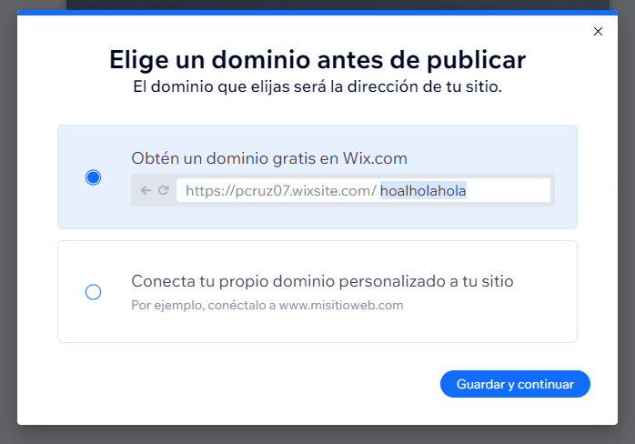

# Lista de hosts de páginas web gratuitos

| Proveedor      | Espacio de almacenamiento | Ancho de banda | Dominios y subdominios | Certificado SSL | Publicidad | Otras características |
|----------------|------------------------|----------------|-----------------------|----------------|------------|--------------------------------|
| [GitHub](https://github.com/) | 1 GB | 100GB al mes | Dominio y subdominio | No, pero soporta HTTPS | No incluye anuncios y puedes poner los tuyos. | Soporte para WordPress. |
| [Free Hosting](https://www.freehosting.com/) | 10 GB | Ilimitado | Dominios, no subdominios | Pagando | Puedes poner anuncios | Compatible con MySQL |
| [InfinityFree](https://www.infinityfree.com/) | 5 GB | Ilimitado | Dominios y subdominios | SSL gratis | No ponen publicidad | Compatible con MySQL |
| [Wix](https://es.wix.com/) | 500 MB | 500 MB | Subdominio y dominio | SSL gratis | No | No tiene soporte para WordPress |
| [Byet](https://byet.host/) | 1 GB | 50 GB | Dominio y subdominio | Solo premium | No | Compatible con MySQL |

No he podido documentar el uso de algunos hosts que he escogido, ya que en [Free Hosting](https://www.freehosting.com/) es obligatorio añadir una tarjeta de crédito a pesar de que se indica que el servicio es gratuito.

## GitHub

Si quieres crear y hostear tu página en GitHub, debes seguir estos pasos

1. Crear un repositorio

*Es recomendable hacerlo con esta configuración*

Ahora, para crear tu página web, elije donde la vas a hacer, ya que GitHub mostrará únicamente uno de estos archivos en tu página: `index.html`, `index.md` o `README.md`.

Vamos a poner como ejemplo que quieres mostrar lo que se ve en tu `README.md`:

2. Ve a la configuración de tu repositorio.

3. Busca `Pages` o `Páginas`en la barra lateral y selecciona estos parámetros. Luego, guarda los cambios.

4. Pon el dominio que quieres para tu página y dale a guardar.

5. Listo! Ya tienes tu página. En este caso, se está mostrando el único archivo que hay, el `README.md`.

https://pcrco.github.io/boca_alpargata/

## InfinityFree

Para crear una página web, primero nos tenemos que crear una cuenta y seleccionar el plan gratis cuando la creemos.

Seguido, crearemos nuestra cuenta para la pagina web. Podemos crear hasta 3.

Esta es la dashboard, donde podemos tanto administrar nuestra pagina como el certificado SSL, el cual es muy fácil de crear, con un par de clicks ya lo tenemos listo.

Entrando al panel de control, encontaremos esto, donde podemos administar nuestra página web, encontrar tutoriales sobre como crearla, administrar bases de datos de MySQL y php, administrar dominios...

Si vamos a edit website y ponemos nuestra URL, accederemos a una pagina con diferentes plantillas para nuestra web. Una vez la seleccionemos, se nos abre un editor donde podemos personalizarla como queramos dentro de las limitaciones que tenemos por el plan gratuito.

Una vez acabada, la podemos publicar simplemente dándole al botón de publicar arriba a la derecha y ya la tendremos lista.

## Wix

Al hacernos nuestra cuenta en Wix, nos da la opción de asistencia con IA. En mi caso, yo lo he rechazado y lo haré paso a paso. 

Al entrar por primera vez, nos saltará un tutorial donde nos guiarán 

Una vez completado, ahora sí, accedemos al panel de control donde podemos administrar nuestra pagina.

Para crear tu página, puedes elegir plantillas o un asistente con IA. Yo he elegido una plantilla.

Este es el editor de la pagina.

Una vez terminada, arriba a la derecha tenemos el botón de `publicar`. Al darle podemos utilizar un dominio gratis de Wix o nuestro dominio personalizado.

¡Hecho, ya está publicado!

## Byet hosting

Byet hosting tiene la misma interfaz que InfinityFree, con la misma diferencia de que no es tan facil crear la página. Aquí no tenemos acceso a plantillas, y la pagina nos dice que para crear nuestra web debemos usar otro programa para luego publicarla aquí.

